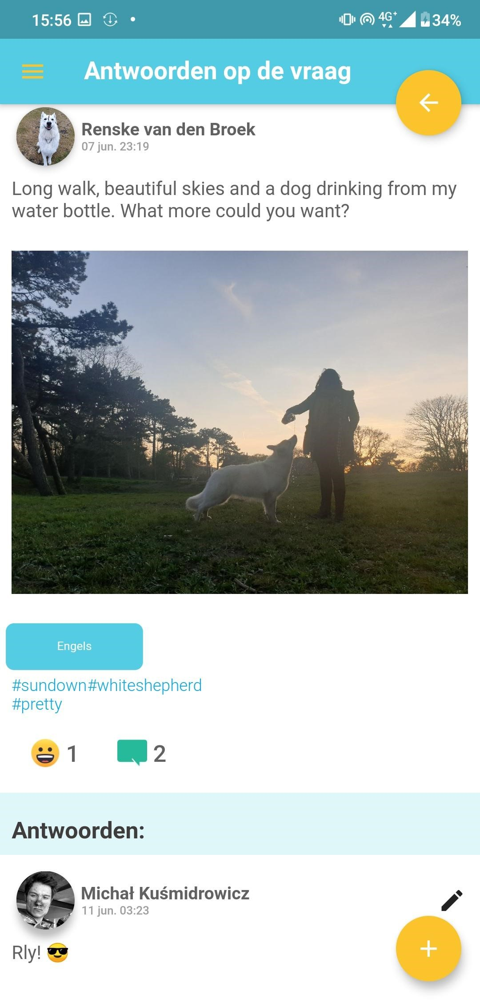
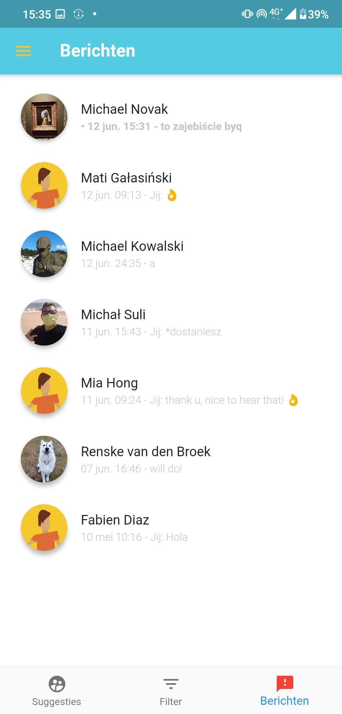

# De Haagse Onderwijsapp (codename - PROJECT: Teachers) 

This application was created as the project for European Project Semester. Thanks to the fact that it is made in [Flutter](https://flutter.dev/) it can be compiled to both Android and iOS executable files.

Nowadays in the Hague, many teachers are leaving the education industry because of the weakened educational base. That means a new teacher has difficulty finding a way to communicate with a skilled teacher and to gain some helpful information. Therefore, we were asked by the client to create a mobile application called “De Haagse Onderwijsapp” - for both android & iOS - that aims to connect education professionals with selected coaches and within themselves. It must allow users to share their skills and learn competencies from others and it should focus on accessibility and interaction between teachers and certified coaches. That way, for the former, the way of learning competencies can be as efficient as possible.

## Watch video

<p align="center">
<a href="https://www.youtube.com/watch?v=f5fdTGTj8Cc&feature=youtu.be">

</a>
</p>

## App description

According to our client’s requirements one of the most crucial challenges of the twenty-first century is the following issue - how can we improve the learning process of our children in the era of ubiquitous digitization? There are many possible answers to that question, and our client came up with one of them - a mobile application providing matchmaking service for educational professionals. Such a platform is meant to deliver an unprecedented dose of flexibility for them, everyone would be able to find guidance from both regular users and ‘coaches’ (easily accessible and well-trained individuals, which will be selected for this role by our client). Our team is sure that this revolutionary solution can successfully introduce the concept of sharing economy (also known as collaborative consumption) to a quite ossified educational system. The final product will give the possibility to every educational professional in the Netherlands to share their knowledge and experience in a peer-to-peer fashion. According to the concept presented by the client, each user will have the opportunity to search for any specific kind of knowledge in two ways:
* By establishing communication with the coach or other educational professionals based on the set of specific filters.
* Via a timeline that gives educational professionals the opportunity to interact, ask questions, reply and search for specific subjects.

The real time data synchronization in our application is realized with asynchronous Cloud Firestore API calls which are executed by appropriate listeners attached to a particular database reference pointing at the specific position in the JSON tree. It works as follows - listener detects all changes regarding tree structure starting from a given point and updates GUI and application logic respectively without a need for reloading the current view. Additionally, all scrollable lists in our app (e.g. user list, timeline, messages or conversation list) are implemented according to the so-called ‘infinite scroll’ pagination mechanism. It means that data is fetched and synchronized in smaller chunks and an additional piece of data is downloaded when the user scrolls the view.

## Screenshots

<p align="center">


</p><br>

<p align="center">


</p><br>

<p align="center">


</p><br>

<p align="center">


</p><br>

<p align="center">


</p><br>

<p align="center">

</p><br>

<p align="center">


</p><br>

<p align="center">


</p><br>

<p align="center">


</p><br>

<p align="center">


</p><br>

<p align="center">


</p><br>

<p align="center">


</p><br>

<p align="center">


</p>

## Download
All releases of the app are avaliable here: https://drive.google.com/drive/folders/1Ylf5X9gtYZvAQSplDuhYd2gm_MiRz-Hy?usp=sharing. 

## Getting Started
These instructions will get you a copy of the project up and running on your local machine for development and testing purposes. 

### Prerequisites
In order to properly build application one might need to install [Flutter](https://flutter.dev/docs/get-started/install).

### Cloning
```
$ git clone https://github.com/ninjarlz/project_teachers
```

### Building
Using e.g. free-to-use Android Studio, import and build the project. Additionaly, one has to create own instance of Firebase project with the 'RectrictedConstants' dart class containing appropriate API keys' definitions at the following location - lib/utils/constants/restricted_constants.dart.

## Built with
* [Flutter](https://flutter.dev/) - The world’s leading app creation platform
* [Firebase](https://firebase.google.com/) - A comprehensive app development platform

The Firebase cloud modules we used in our app are as follows:
* [Auth](https://firebase.google.com/docs/auth) - supports logging via two systems - social login providers (Facebook, Github, Twitter, Google, etc.) or an email and a password stored in Firebase. Firebase Auth API provides a handy and easy-to-use interface for administration of users’ accounts and enabling specific authentication methods.
* [Cloud Firestore](https://firebase.google.com/docs/firestore) - stores and synchronizes data with Firebase’s cloud. It is a non-relational kind of database, in which data is represented in the form of a simple JSON tree. It allows us to introduce realtime database synchronization in our application - all changes concerning subscribed data are visible almost immediately, without the need for reloading the current view of the application.
* [Cloud Storage](https://firebase.google.com/docs/storage) - a very simple, yet powerful storage option, being cost-effective at the same time. It allows Firebase apps uploading and downloading files, regardless of network quality, using asynchronous functions.

## Developers
* **Michał Kuśmidrowicz** - Fullstack - [ninjarlz](https://github.com/ninjarlz)
* **Fabien Diaz** - Frontend -[TheScayn](https://github.com/TheScayn)

## License
This project is licensed under the MIT License - see the [LICENSE.md](LICENSE.md) file for details
